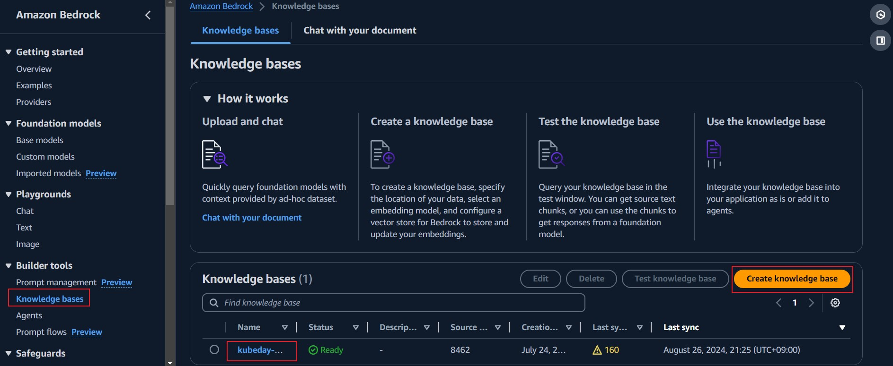
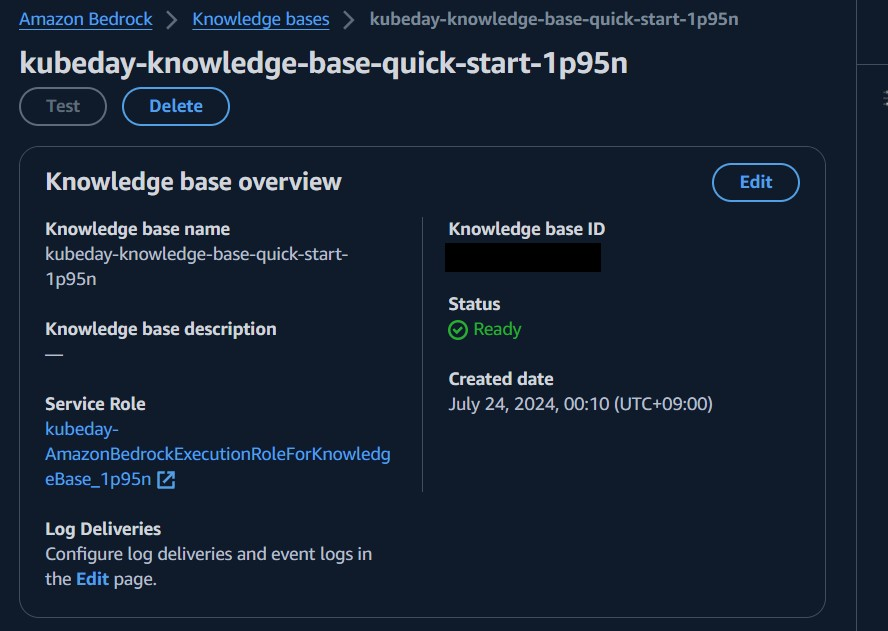

# Kubeday Japan 2024

# Table of Contents

- [Kubeday Japan 2024](#kubeday-japan-2024)
  - [5G Cluster on EKS + AI Issue Navigation](#5g-cluster-on-eks--ai-issue-navigation)
    - [EKS Deployment - CDK](#eks-deployment---cdk)
      - [bin/my-blueprints.ts Code](#binmy-blueprintsts-code)
      - [lib/my-blueprints-stack.ts Code](#libmy-blueprints-stackts-code)
    - [EKS Open5G SW installation](#eks-open5g-sw-installation)
      - [Deployment of NGC and Registration of Subscribers](#deployment-of-ngc-and-registration-of-subscribers)
        - [Deploy the NGC (open5gs)](#step-1-deploy-the-ngc-open5gs)
        - [Deploy the RAN (srsran-5g-zmq)](#step-2-deploy-the-ran-srsran-5g-zmq)
      - [Verify Deployment](#verify-deployment)
        - [Verify Connection between SMF and UPF](#step-1-verify-connection-between-smf-and-upf-c-plane-and-u-plane-of-ngc)
        - [Verify Connection between AMF and gNodeB](#step-2-verify-connection-between-amf-and-gnodeb)
    - [AWS Services Implementation](#aws-services-implementation)
      - [AWS Lambda](#aws-lambda)
      - [AWS S3](#aws-s3)
      - [Amazon Bedrock](#amazon-bedrock)
        - [Knowledge Base](#knowledge-base)
        - [Knowledge Base ID](#knowledge-base-id)
    - [API implementation and tests](#api-implementation-and-tests)


## 5G Cluster on EKS + AI Issue Navigation

### EKS Deployment - CDK

Here are the steps to initialize a base app using typescript language, then you will install related EKS blueprints

1. Install Node Version Manager (n) `npm install -g n`

2. Install Stable Version of Node.js `n stable`

3. Install AWS CDK `npm install -g aws-cdk@2.147.3`

4. Verify AWS CDK Installation `cdk --version`

5. Initialize sample app with `cdk init app --language typescript`

6. Install the eks-blueprints NPM package `npm i @aws-quickstart/eks-blueprints`

7. Modify Following ts files:

#### bin/my-blueprints.ts Code

```typescript
import * as cdk from 'aws-cdk-lib';
import * as blueprints from '@aws-quickstart/eks-blueprints';

class FluentBitAddOn implements blueprints.ClusterAddOn {
    deploy(clusterInfo: blueprints.ClusterInfo): void {
        const cluster = clusterInfo.cluster;
        
        // Define the Helm chart for Fluent Bit
        cluster.addHelmChart('fluent-bit', {
            chart: 'fluent-bit',
            release: 'fluent-bit',
            repository: 'https://fluent.github.io/helm-charts',
            namespace: 'kube-system',
            values: {
                serviceAccount: {
                    create: true,
                    name: 'fluent-bit'
                },
                config: {
                    service: {
                        Flush: 1,
                        Log_Level: 'debug',
                    },
                    inputs: [
                        {
                            name: "tail",
                            path: "/var/log/containers/*.log",
                            parser: "docker"
                        }
                    ],
                    outputs: [
                        {
                            name: "cloudwatch",
                            match: "*",
                            region: region,
                            log_group_name: "/aws/containerinsights/eks-blueprint/application"
                        }
                    ]
                }
            }
        });
    }
}

const app = new cdk.App();
const account = 'ACCOUNT_ID';
const region = 'us-east-1';
const version = 'auto';

blueprints.HelmAddOn.validateHelmVersions = true; // optional if you would like to check for newer versions

const addOns: Array<blueprints.ClusterAddOn> = [
    new blueprints.addons.ArgoCDAddOn(),
    new blueprints.addons.MetricsServerAddOn(),
    new blueprints.addons.ClusterAutoScalerAddOn(),
    new blueprints.addons.AwsLoadBalancerControllerAddOn(),
    new blueprints.addons.VpcCniAddOn(),
    new blueprints.addons.CoreDnsAddOn(),
    new blueprints.addons.KubeProxyAddOn(),
    new FluentBitAddOn() // Adding Fluent Bit
];

const stack = blueprints.EksBlueprint.builder()
    .account(account)
    .region(region)
    .version(version)
    .addOns(...addOns)
    .useDefaultSecretEncryption(true) // set to false to turn secret encryption off (non-production/demo cases)
    .build(app, 'eks-kubeday-2024');
```
#### lib/my-blueprints-stack.ts Code

```typescript
import * as cdk from 'aws-cdk-lib';
import { Construct } from 'constructs';
// import * as sqs from 'aws-cdk-lib/aws-sqs';

export class MyBlueprintsStack extends cdk.Stack {
  constructor(scope: Construct, id: string, props?: cdk.StackProps) {
    super(scope, id, props);

  }
}
```

8. Bootstrap your environment with the following command: `cdk bootstrap aws://<your-account-number>/<region-to-bootstrap>`

9. If no errors up to this part, proceed with the CDK deploy operation: `cdk deploy`

10. Once the deployment is completed, you will similar output in your terminal:

```Bash
Outputs:
east-test-1.easttest1ClusterName8D8E5E5E = <region>
east-test-1.easttest1ConfigCommand25ABB520 = aws eks update-kubeconfig --name <region> --region <region>--role-arn <ROLE_ARN>
east-test-1.easttest1GetTokenCommand337FE3DD = aws eks get-token --cluster-name <region> --region <region> --role-arn <ROLE_ARN>

Stack ARN:
arn:aws:cloudformation:us-east-1:115717706081:stack/<region>/ARN
```

11. To update your Kubernetes config for you new cluster, execute the `aws eks update-kubeconfig` command show in step 10.

12. Now you should be able to execute kubectl commands and start deploying applications

```Shell
kubectl get nodes
NAME                           STATUS   ROLES    AGE   VERSION
ip-10-0-104-250.ec2.internal   Ready    <none>   11d   v1.29.3-eks-ae9a62a
ip-10-0-187-88.ec2.internal    Ready    <none>   13d   v1.29.3-eks-ae9a62a
```
### EKS Open5G SW installation:

Once the Kubernetes cluster is deployed, we can proceed with the 5G application installation:

#### Deployment of NGC and Registration of Subscribers

1. To pull the Helm charts for `open5gs` and `srsran-5g-zmq` from the OCI registry, use the following commands:

```sh
helm pull oci://registry-1.docker.io/gradiant/open5gs --version 2.2.0
helm pull oci://registry-1.docker.io/gradiant/srsran-5g-zmq --version 1.0.0
```
2. Deployment of NGC and Registration of Subscribers

To deploy the NGC (Next Generation Core) and register subscribers, follow these steps:

##### Step 1: Deploy the NGC (open5gs)

Use the following Helm command to install the `open5gs` chart. This deployment uses a specific values file provided by Gradiant.

```sh
helm install open5gs oci://registry-1.docker.io/gradiant/open5gs --version 2.2.0 --values https://gradiant.github.io/5g-charts/docs/open5gs-srsran-5g-zmq/ngc-values.yaml
```

##### Step 2:  Deploy the RAN (srsran-5g-zmq)
```sh
helm install srsran-5g-zmq oci://registry-1.docker.io/gradiant/srsran-5g-zmq --version 1.0.0
```

#### Verify Deployment

After deploying the NGC and RAN, follow these steps to verify the deployment and ensure proper connectivity:

##### Step 1: Verify Connection between SMF and UPF (C-Plane and U-Plane of NGC)

Check that the SMF (Session Management Function) gets associated with the UPF’s (User Plane Function) address:

```sh
kubectl logs deployment/open5gs-smf -f
```

##### Step 2: Verify Connection between AMF and gNodeB

Check that the AMF (Access and Mobility Management Function) accepts and adds the gNodeB:

```sh
kubectl logs deployment/open5gs-amf -f
```

### AWS Services Implementation

#### AWS Lambda

Here is the code we implemented to filter Fluentbit/Cloudwatch logs:

```python
import boto3
import os
import datetime

"""
This portion will obtain the Environment variables from AWS Lambda.
"""

GROUP_NAME = os.environ['GROUP_NAME']
DESTINATION_BUCKET = os.environ['DESTINATION_BUCKET']
PREFIX = os.environ['PREFIX']
NDAYS = os.environ['NDAYS']
nDays = int(NDAYS)

currentTime = datetime.datetime.now()
StartDate = currentTime - datetime.timedelta(days=nDays)
EndDate = currentTime - datetime.timedelta(days=nDays - 1)


"""
Convert the from & to Dates to milliseconds
"""

fromDate = int(StartDate.timestamp() * 1000)
toDate = int(EndDate.timestamp() * 1000)


BUCKET_PREFIX = os.path.join(PREFIX, StartDate.strftime('%Y{0}%m{0}%d').format(os.path.sep))


def lambda_handler(event, context):
    client = boto3.client('logs')
    client.create_export_task(
         logGroupName=GROUP_NAME,
         fromTime=fromDate,
         to=toDate,
         destination=DESTINATION_BUCKET,
         destinationPrefix=BUCKET_PREFIX
        )

```

#### AWS S3

1. Create the S3 bucket in the us-east-1 region use the following command:

```
aws s3 mb s3://kubeday-5gcore-logs-ingestion --region us-east-1

```

2. Upload the zip files to your S3 bucket using AWS CLI command:

```
aws s3 cp /path/to/your/file.zip s3://kubeday-5gcore-logs-ingestion/

```
or

```
aws s3 cp /path/to/your/folder s3://kubeday-5gcore-logs-ingestion/ --recursive --exclude "*" --include "*.zip"
```

#### Amazon Bedrock

Amazon Bedrock is a fully managed service that provides access to pre-trained foundation models from leading AI companies, enabling developers to build and scale generative AI applications without managing infrastructure.

##### Knowledge Base




##### Knowledge Base ID




### API implementation and tests


To run the backend API, replace the Knowledge Base ID with your own ID and run the command

```
python 5gc_kubedayjapan2024/ai_llm_5g.py
```

Happy Learning 🚀
